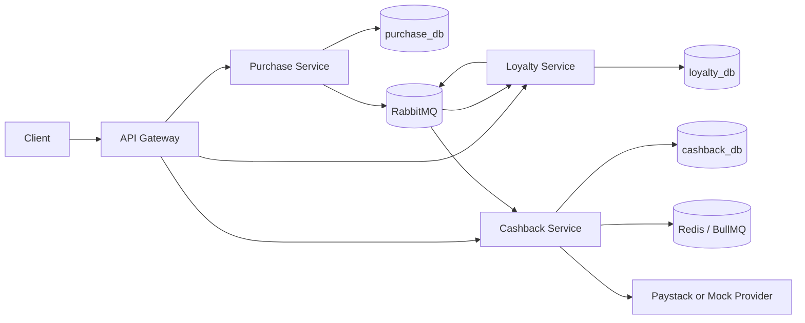

# Bumpa Achievement System

Event-driven NestJS backend for purchase achievements, badges, and automated cashback.

## Architecture

The system is split into independently deployable services. Each service owns its data and communicates through RabbitMQ events.



## Service Boundaries

- `api-gateway`: public HTTP API, validation, response wrapping, Swagger docs, service routing.
- `purchase-service`: users, purchases, and `PurchaseCompleted.v1` events.
- `loyalty-service`: configurable achievements, badges, progress endpoint, and unlock events.
- `cashback-service`: cashback transactions, payout accounts, payment provider integration, Paystack webhooks.
- `packages/events-sdk`: shared event contracts, enums, readable ID helpers.
- `packages/broker-sdk`: RabbitMQ publish/subscribe wrapper with publisher confirms.
- `packages/outbox-sdk`: transactional outbox publisher with Redis lock and retry scanner.
- `packages/logger-sdk`: JSON logging and correlation ID middleware.

In Docker Compose, only the API gateway publishes a host port. Postgres, RabbitMQ, Redis, and the internal microservices are reachable only by containers on the backend network.

## Reliability Choices

- TypeORM is used for persistence.
- Database schema is managed with TypeORM migrations; `synchronize` is disabled.
- Events are written to an outbox inside the same database transaction as domain changes.
- Fresh outbox rows are published immediately after commit.
- The background outbox scanner only retries pending rows left by broker failures or process crashes.
- RabbitMQ publisher confirms decide when an outbox row is marked `PUBLISHED`.
- Consumers use idempotency tables to ignore duplicate events.
- Cashback jobs use BullMQ retries.
- A failed consumer handler is retried via a RabbitMQ retry queue with escalating backoff (1s → 30s, 5 attempts) before it's dead-lettered, so retry state survives a process crash or reconnect.

## Main Flow

1. `POST /purchases` creates a purchase.
2. Purchase service emits `PurchaseCompleted.v1`.
3. Loyalty service updates user stats and unlocks matching achievements.
4. Loyalty service emits `AchievementUnlocked.v1` and, when eligible, `BadgeUnlocked.v1`.
5. Cashback service creates a cashback transaction and pays 300 Naira through the configured provider.

## API

Swagger is available through the public gateway:

- Gateway: `http://localhost:3000/docs`

The internal services also expose Swagger when run directly outside Compose, but their ports are not published by the default Docker stack.

Gateway responses use a consistent envelope:

```json
{
  "success": true,
  "statusCode": 200,
  "data": {},
  "timestamp": "2026-08-23T12:00:00.000Z"
}
```

## Run Locally

```bash
npm install
docker compose up --build
```

Only `API_GATEWAY_HOST_PORT` is published by default:

```bash
API_GATEWAY_HOST_PORT=3100 docker compose up --build
```

Important endpoints:

- `POST http://localhost:3000/purchases`
- `GET http://localhost:3000/users/{userId}/achievements`
- `GET http://localhost:3000/admin/achievements` — paginated, admin-key protected
- `GET http://localhost:3000/admin/badges` — paginated, admin-key protected
- `GET http://localhost:3000/cashbacks` — paginated, admin-key protected
- `POST http://localhost:3000/cashbacks/{id}/retry` — admin-key protected

### Admin & cashback access

`/admin/*` and `/cashbacks*` require an `x-api-key` header matching `ADMIN_API_KEY`. Docker Compose sets a dev default (`bumpa-local-admin-key`) so the stack works out of the box; override it for anything beyond local use:

```bash
ADMIN_API_KEY=a-real-secret docker compose up --build
curl -H "x-api-key: a-real-secret" http://localhost:3000/cashbacks
```

This is a shared-secret gate, not user authentication — there's no user-account/role model in this system. It's the minimum bar the assessment doc itself calls out as needed before these endpoints go to production.

### Pagination and filtering

All three list endpoints accept `page` (default 1) and `limit` (default 20, max 100). `/admin/achievements` also accepts `groupKey` and `active`; `/admin/badges` accepts `active`; `/cashbacks` accepts `userId` and `status`. All three accept `search` (case-insensitive, matches name/description or badge name/userId/provider reference). Responses are shaped as `{ items: [...], meta: { page, limit, total, totalPages } }`.

```bash
curl -H "x-api-key: bumpa-local-admin-key" \
  "http://localhost:3000/cashbacks?userId=usr_customer_001&status=FAILED&page=1&limit=10"
```

### Retrying a failed cashback

If a badge unlocks for a user with no bank details on file, the cashback transaction ends up `FAILED` without wasting BullMQ retries on a condition retrying can't fix. Once the user's bank details are known, resume it:

```bash
curl -X POST -H "x-api-key: bumpa-local-admin-key" -H "Content-Type: application/json" \
  -d '{"bankAccountNumber":"0123456789","bankCode":"058"}' \
  http://localhost:3000/cashbacks/{id}/retry
```

## Local Development Tools

`docker-compose.yml` stays prod-safe by default — only the gateway's port is published. For local debugging, `docker-compose.dev.yml` is an overlay that also exposes Postgres, Redis, RabbitMQ, and each microservice directly:

```bash
npm run docker:dev
```

This gives you:

- **Postgres** on `localhost:5432` (`bumpa`/`bumpa`) — connect a DB client and inspect `purchase_db`, `loyalty_db`, `cashback_db` directly.
- **Redis** on `localhost:6379`.
- **RabbitMQ management UI** at `http://localhost:15672` (`bumpa`/`bumpa`) — the Queues tab shows every queue live, including the `.retry` and `.dlq` queues for each consumer, so you can watch messages move between them or inspect a dead-lettered payload by hand.
- Each microservice directly: `purchase-service:3001`, `loyalty-service:3002`, `cashback-service:3004`.

### Watching events in real time

With the dev overlay running, tail every domain event as it's published, with its payload, in a readable, color-coded console feed — good for demos or just seeing the purchase → achievement → badge → cashback chain fire in order:

```bash
npm run watch:events
```

```
● PurchaseCompleted.v1  6:04:51 AM
  eventId       evt_e35674148b4c
  correlationId corr_ae01832212a0
  payload
    { "userId": "usr_watch_demo", "amountKobo": 500000, ... }

● AchievementUnlocked.v1  6:04:51 AM
  ...
```

It works by binding a private, auto-delete queue to the shared event exchange with a wildcard routing key — it sees a copy of everything without taking anything away from the real consumers, and RabbitMQ cleans it up the moment you stop the script (`Ctrl+C`). It never shows up in the management UI's queue list under normal use since it only exists while running.

## Tests

```bash
npm test
npm run test:e2e:docker
```

`npm test` runs fast unit/integration specs. `npm run test:e2e:docker` starts the Docker Compose stack and verifies the full purchase-to-cashback flow through the gateway.

## Payment Provider

The default provider is `mock`, which lets the full flow run locally without external credentials.

To test Paystack, copy `.env.docker.example` to `.env` and fill in a real `PAYSTACK_SECRET_KEY` (Paystack Dashboard → Settings → API Keys & Webhooks → Test Secret Key):

```bash
cp .env.docker.example .env
# edit .env: set PAYMENT_PROVIDER=paystack and PAYSTACK_SECRET_KEY=sk_test_...
docker compose up --build
```

`.env` is git-ignored — it's never committed, and Docker Compose loads it automatically with no extra flags needed. `.env.docker.example` lists only the handful of variables Docker Compose actually reads; everything else (DB/RabbitMQ/Redis settings) is intentionally hardcoded in `docker-compose.yml` — see the comment there for why.

If Paystack is selected without a secret key, the provider uses a dry-run path so local e2e tests still complete.
