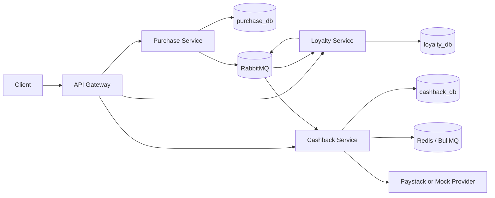

# Bumpa Achievement System

Event-driven NestJS backend for purchase achievements, badges, and automated cashback.

## Architecture

The system is split into independently deployable services. Each service owns its data and communicates through RabbitMQ events.



## Service Boundaries

- `api-gateway`: public HTTP API, validation, response wrapping, Swagger docs, service routing.
- `purchase-service`: users, purchases, and `PurchaseCompleted.v1` events.
- `loyalty-service`: configurable achievements, badges, progress endpoint, and unlock events.
- `cashback-service`: cashback transactions, payout accounts, payment provider integration, Paystack webhooks.
- `packages/events-sdk`: shared event contracts, enums, readable ID helpers.
- `packages/broker-sdk`: RabbitMQ publish/subscribe wrapper with publisher confirms.
- `packages/outbox-sdk`: transactional outbox publisher with Redis lock and retry scanner.
- `packages/logger-sdk`: JSON logging and correlation ID middleware.

## Reliability Choices

- TypeORM is used for persistence.
- Database schema is managed with TypeORM migrations; `synchronize` is disabled.
- Events are written to an outbox inside the same database transaction as domain changes.
- Fresh outbox rows are published immediately after commit.
- The background outbox scanner only retries pending rows left by broker failures or process crashes.
- RabbitMQ publisher confirms decide when an outbox row is marked `PUBLISHED`.
- Consumers use idempotency tables to ignore duplicate events.
- Cashback jobs use BullMQ retries.

## Main Flow

1. `POST /purchases` creates a purchase.
2. Purchase service emits `PurchaseCompleted.v1`.
3. Loyalty service updates user stats and unlocks matching achievements.
4. Loyalty service emits `AchievementUnlocked.v1` and, when eligible, `BadgeUnlocked.v1`.
5. Cashback service creates a cashback transaction and pays 300 Naira through the configured provider.

## API

Swagger is available per service:

- Gateway: `http://localhost:3000/docs`
- Purchase service: `http://localhost:3001/docs`
- Loyalty service: `http://localhost:3002/docs`
- Cashback service: `http://localhost:3004/docs`

Gateway responses use a consistent envelope:

```json
{
  "success": true,
  "statusCode": 200,
  "data": {},
  "timestamp": "2026-08-23T12:00:00.000Z"
}
```

## Run Locally

```bash
npm install
docker compose up --build
```

Important endpoints:

- `POST http://localhost:3000/purchases`
- `GET http://localhost:3000/users/{userId}/achievements`
- `GET http://localhost:3000/admin/achievements`
- `GET http://localhost:3000/admin/badges`
- `GET http://localhost:3000/cashbacks`

## Tests

```bash
npm test
npm run test:e2e:docker
```

`npm test` runs fast unit/integration specs. `npm run test:e2e:docker` starts the Docker Compose stack and verifies the full purchase-to-cashback flow through the gateway.

## Payment Provider

The default provider is `mock`, which lets the full flow run locally without external credentials.

To test Paystack:

```bash
PAYMENT_PROVIDER=paystack \
PAYSTACK_SECRET_KEY=sk_test_xxx \
PAYSTACK_WEBHOOK_SECRET=whsec_xxx \
docker compose up --build
```

If Paystack is selected without a secret key, the provider uses a dry-run path so local e2e tests still complete.
