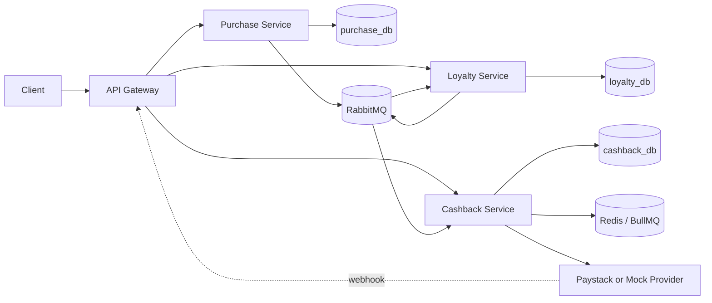
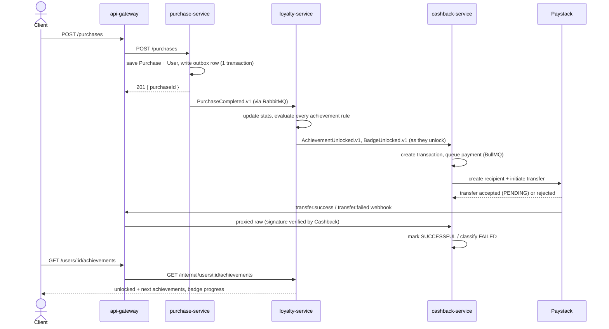

# Bumpa Achievement System

Event-driven NestJS backend for purchase achievements, badges, and automated cashback.

## Live Demo

| | |
|---|---|
| **API** | [http://72.62.192.213:8090](http://72.62.192.213:8090) — the API gateway; Swagger docs at [`/docs`](http://72.62.192.213:8090/docs), health at [`/health`](http://72.62.192.213:8090/health). Every request from purchase creation through achievement/badge unlocks and cashback payout goes through here. |
| **Live event stream** | [http://72.62.192.213:4100](http://72.62.192.213:4100) — a browser dashboard tapping the RabbitMQ event bus over SSE in real time. Open it, then hit the API (e.g. create a purchase), and watch `PurchaseCompleted.v1` → `AchievementUnlocked.v1` / `BadgeUnlocked.v1` → `CashbackProcessed.v1` land as they're published — no polling, no terminal needed. |

Deployed via GitHub Actions on every push to `main`/`deploy` that passes CI (see `.github/workflows/`).
Runs with `PAYMENT_PROVIDER=mock`, so cashback payouts are simulated rather than hitting real Paystack.

**Full docs map:**
[`API.md`](API.md) (every endpoint/payload) ·
[`apps/api-gateway/README.md`](apps/api-gateway/README.md) ·
[`apps/purchase-service/README.md`](apps/purchase-service/README.md) ·
[`apps/loyalty-service/README.md`](apps/loyalty-service/README.md) ·
[`apps/cashback-service/README.md`](apps/cashback-service/README.md) ·
[`packages/events-sdk/README.md`](packages/events-sdk/README.md) ·
[`packages/broker-sdk/README.md`](packages/broker-sdk/README.md) ·
[`packages/outbox-sdk/README.md`](packages/outbox-sdk/README.md) ·
[`packages/logger-sdk/README.md`](packages/logger-sdk/README.md)

## Architecture

The system is split into independently deployable services. Each service owns its own database
and communicates with the others only through RabbitMQ events — no service ever reaches into
another's database or calls it synchronously except through the gateway.



In Docker Compose, only the API gateway publishes a host port. Postgres, RabbitMQ, Redis, and
every microservice are reachable only by containers on the backend network — including for
Paystack's webhook, which has to reach the gateway and get proxied in, because
`cashback-service` (who actually owns it) has no public address in any environment.

## Service Boundaries

| Service | Owns | README |
|---|---|---|
| `api-gateway` | public HTTP API, validation, response envelope, Swagger, request routing, the Paystack webhook's public entrypoint | [→](apps/api-gateway/README.md) |
| `purchase-service` | users, purchases, `PurchaseCompleted.v1` | [→](apps/purchase-service/README.md) |
| `loyalty-service` | configurable achievements/badges, per-user progress, unlock events | [→](apps/loyalty-service/README.md) |
| `cashback-service` | cashback transactions, payout accounts, payment-provider integration, failure classification + retry, Paystack webhook processing | [→](apps/cashback-service/README.md) |
| `packages/events-sdk` | shared event contracts, enums, readable id helpers | [→](packages/events-sdk/README.md) |
| `packages/broker-sdk` | RabbitMQ publish/subscribe, publisher confirms, per-subscription retry queue | [→](packages/broker-sdk/README.md) |
| `packages/outbox-sdk` | transactional outbox publisher, Redis lock, retry scanner | [→](packages/outbox-sdk/README.md) |
| `packages/logger-sdk` | JSON logging, correlation ids, request logging | [→](packages/logger-sdk/README.md) |

## The Full Flow



Every arrow between services after the first `POST /purchases` is a RabbitMQ event, not a
synchronous HTTP call — the gateway's own request already returned before any of it happens.
That's deliberate: achievement/badge/cashback processing shouldn't make a customer's purchase
request wait on it, and a slow or briefly-down downstream service shouldn't be able to fail a
purchase.

## Why It's Built This Way

A few choices here exist specifically because "just make the demo work" and "handle it the way
a real payment system has to" are different bars, and this was built for the second one.

### The transactional outbox (all three data-owning services)

A domain write and its announcing event are written in the **same database transaction** —
never "save the purchase, then separately try to publish an event." If the process crashes
between those two steps, or RabbitMQ is unreachable for a moment, a plain "publish after save"
approach loses the event silently: the purchase exists, nothing downstream ever hears about it.

Here, the event row commits atomically with the domain row. Publishing is a *separate*
best-effort step afterward (immediate attempt, plus a background scanner that catches anything
the immediate attempt missed) — so the guarantee isn't "publish never fails," it's "the intent
to publish can never be lost." Full design + diagram: [`packages/outbox-sdk/README.md`](packages/outbox-sdk/README.md).

### RabbitMQ retry queues, not in-process timers

A consumer handler that throws gets redelivered through a dedicated `.retry` queue with
escalating backoff (1s → 2s → 4s → 8s → 16s → 30s cap, 5 attempts) before landing in a `.dlq`
for manual inspection. The retry *state* — how many attempts, how long to wait — lives in
RabbitMQ (a message header + a queue TTL), not in an in-memory timer, so a process restart or
crash mid-retry doesn't lose it. Full design + diagram: [`packages/broker-sdk/README.md`](packages/broker-sdk/README.md).

### Idempotent consumers

Because a message can be redelivered (the retry mechanism above, or a reconnect replaying an
unacked message), every consumer checks a `processed_events` table by `eventId` before doing
real work, and skips if it's already there. This is a different mechanism from the outbox on
purpose — the outbox guarantees the *publisher* announced something at least once; this
guarantees the *consumer* only acts on it exactly once, even if it heard about it more than once.

### Two-tier cashback retry + real failure classification

Payment failures aren't one thing. "Paystack is briefly down" and "this bank account doesn't
exist" both come back as an HTTP error, but only one of them is worth retrying — retrying the
other one forever just wastes calls and delays the moment a human finds out something needs
fixing. Every cashback failure gets classified (`INSUFFICIENT_BALANCE`, `INVALID_ACCOUNT`,
`PROVIDER_MISCONFIGURED`, etc. — full table in [`API.md`](API.md#cashback-failure-classification)),
keyed off Paystack's own machine-readable error codes where available, confirmed against the
real API rather than assumed. Only the classified-retryable ones get retried, first fast (BullMQ,
seconds) then slow (an interval scanner, backing off from 5 minutes to 1 hour). Everything else
waits for a human. Full design + diagram: [`apps/cashback-service/README.md`](apps/cashback-service/README.md).

### Configurable achievements and badges

Nothing about what unlocks what is hardcoded — achievement rules (`COUNT`, `SUM`,
`COMBINATION`, `ACHIEVEMENT_SET`), the groups achievements belong to, and badge thresholds are
all rows an admin creates and edits over HTTP, validated at the write boundary so a malformed
rule (or an achievement pointing at a group that doesn't exist — `groupKey` is a real foreign
key, not free text) can never reach the database and crash evaluation later on some unrelated
user's purchase. Full explanation: [`apps/loyalty-service/README.md`](apps/loyalty-service/README.md).

### Everything correlates

One customer-facing request gets one correlation id (`x-correlation-id`), generated at the
gateway and forwarded to every service it touches. Combined with every service logging through
the same `JsonLogger` shape, `docker compose logs | grep corr_...` reconstructs one request's
entire journey across every service it passed through.

## Idempotency and Retries

There isn't one idempotency mechanism or one retry mechanism in this system — there are several,
each solving a different failure mode at a different layer. Listed together here because that's
easy to lose track of when each one lives in a different service's code; the per-service READMEs
cover each in more depth.

### Every "can this happen twice?" is answered somewhere

| Where | Guard | What it actually prevents |
|---|---|---|
| `POST /purchases` | client-supplied `x-idempotency-key`, unique DB constraint + pre-check | a client retrying a timed-out request creates one purchase, not two — the retry gets the original `purchaseId` back |
| every event consumer | `processed_events` table, checked by `eventId` before doing real work | a redelivered message (from the broker retry queue below, or a reconnect replaying an unacked message) doesn't get processed twice |
| outbox publish | conditional `UPDATE ... WHERE status = 'PENDING'` (`PENDING → PUBLISHING`) | the immediate post-commit publish and a concurrent scanner tick can't both publish the same row |
| achievement/badge unlock | in-memory check against already-unlocked ids, backed by a DB unique constraint (`userId`+`achievementId` / `userId`+`badgeId`) | the same achievement/badge never unlocks twice for one user, even if two purchases for that user are processed concurrently by two service replicas — see note below |
| cashback creation | unique `(userId, badgeName)` constraint, upserted on `BadgeUnlocked.v1` | a redelivered `BadgeUnlocked.v1` never creates a second payout attempt for the same badge |
| cashback payment | conditional `UPDATE ... WHERE status = 'PENDING'` (`PENDING → PROCESSING`) before calling the provider | two workers racing on the same transaction can't both call Paystack for it |
| cashback provider call | `providerReference` generated and saved *before* the outbound call, not after | Paystack's webhook can find the transaction row no matter which of "our call returns" or "the webhook arrives" happens first — see `apps/cashback-service/README.md` |
| Paystack webhook | unknown `reference`, or a transaction already in a terminal state, is a no-op that still returns `200` | Paystack redelivering a webhook it already sent doesn't double-apply it |

The achievement/badge race is worth calling out precisely: the in-memory check is what makes the
*common* case a clean no-op, but if two replicas genuinely race each other, the loser hits the
DB's unique constraint and its `PurchaseCompleted.v1` handler throws — which the broker retry
queue (below) catches and redelivers. By the time it's redelivered, the winner's unlock is
already committed, so the in-memory check now correctly skips it. The retry queue isn't just
"retry on transient failure" here — it's also what turns that race into an eventually-consistent
no-op instead of a crash.

### Four different retry layers, not one

| Layer | Lives in | Retries what | Backoff |
|---|---|---|---|
| RabbitMQ retry queue | `@bumpa/broker-sdk`, every consumer | a consumer handler that threw | 1s → 2s → 4s → 8s → 16s → 30s cap, 5 attempts, then dead-lettered |
| Outbox scanner | `@bumpa/outbox-sdk`, every publisher | an event that was written but never confirmed published (crash, or RabbitMQ briefly unreachable) | fixed poll interval (`OUTBOX_POLL_INTERVAL_MS`, default 30s), up to `maxAttempts` |
| BullMQ job retry (fast tier) | `cashback-service` only | a cashback payment attempt classified retryable, immediately after it fails | exponential, starts at 1s, 3 attempts, all within the same job |
| Interval auto-retry (slow tier) | `cashback-service` only | a cashback payment that exhausted the fast tier and is still classified retryable | 5min → 10min → 20min → 40min → 1h cap, up to `CASHBACK_MAX_AUTO_RETRIES` (default 5) |

They're not redundant with each other — each exists because the one "above" it isn't the right
tool for that failure's timescale. A consumer handler throwing is usually transient and cheap to
retry in seconds (RabbitMQ retry queue); a crashed process losing track of an unpublished event
needs a scanner that survives the crash (outbox scanner); a real payment-provider call is slow
and shouldn't be retried in a tight loop inside one HTTP request (BullMQ fast tier, then the slow
interval tier once fast retries are exhausted). See `apps/cashback-service/README.md` for the
two-tier retry's own flowchart and the full failure-classification table that decides which
failures ever reach a retry layer at all.

## Migrations and Seeding

Migrations run automatically on every service boot (`migrationsRun: true` in each
`app.module.ts`) — connect to Postgres, run whatever migration isn't yet in the history table,
then finish bootstrapping. No manual step, nothing to remember to run separately.

`loyalty-service` additionally seeds a handful of default achievements/badges on first boot
(`LoyaltyConfigSeederService`, also runs on every boot but only inserts rows that don't already
exist by `id` — it never touches or resets anything an admin has since created or edited).

## API

Swagger is available through the public gateway:

- Gateway: `http://localhost:3000/docs`

The internal services also expose Swagger when run directly outside Compose, but their ports
aren't published by the default Docker stack.

Gateway responses use a consistent envelope; full endpoint-by-endpoint reference, payloads, and
error shapes are in [`API.md`](API.md).

```json
{
  "success": true,
  "statusCode": 200,
  "data": {},
  "timestamp": "2026-08-23T12:00:00.000Z"
}
```

## Run Locally

```bash
npm install
docker compose up --build
```

Only `API_GATEWAY_HOST_PORT` is published by default:

```bash
API_GATEWAY_HOST_PORT=3100 docker compose up --build
```

Important endpoints (full reference: [`API.md`](API.md)):

- `POST http://localhost:3000/purchases`
- `GET http://localhost:3000/users/{userId}/achievements`
- `GET http://localhost:3000/admin/achievements` — paginated, admin-key protected
- `GET http://localhost:3000/admin/badges` — paginated, admin-key protected
- `GET http://localhost:3000/cashbacks` — paginated, admin-key protected
- `POST http://localhost:3000/cashbacks/{id}/retry` — admin-key protected, queued (`202`)

### Admin & cashback access

`/admin/*` and `/cashbacks*` require an `x-api-key` header matching `ADMIN_API_KEY`. Docker
Compose sets a dev default (`bumpa-local-admin-key`) so the stack works out of the box; override
it for anything beyond local use:

```bash
ADMIN_API_KEY=a-real-secret docker compose up --build
curl -H "x-api-key: a-real-secret" http://localhost:3000/cashbacks
```

This is a shared-secret gate, not user authentication — there's no user-account/role model in
this system. It's the minimum bar the assessment doc itself calls out as needed before these
endpoints go to production.

### Pagination and filtering

All three list endpoints accept `page`/`limit`/`search`; details and per-endpoint filters:
[`API.md`](API.md#pagination-and-search).

```bash
curl -H "x-api-key: bumpa-local-admin-key" \
  "http://localhost:3000/cashbacks?userId=usr_customer_001&status=FAILED&page=1&limit=10"
```

### Retrying a failed cashback

```bash
curl -X POST -H "x-api-key: bumpa-local-admin-key" -H "Content-Type: application/json" \
  -d '{"bankAccountNumber":"0123456789","bankCode":"058"}' \
  http://localhost:3000/cashbacks/{id}/retry
```

Returns `202` immediately (see [`apps/cashback-service/README.md`](apps/cashback-service/README.md#two-tier-retry)
for why it's async) — poll `GET /cashbacks` to see the outcome. Many failures also retry
themselves automatically before you'd even need this.

## Local Development Tools

`docker-compose.yml` stays prod-safe by default — only the gateway's port is published. For
local debugging, `docker-compose.dev.yml` is an overlay that also exposes Postgres, Redis,
RabbitMQ, and each microservice directly:

```bash
npm run docker:dev
```

This gives you:

- **Postgres** on `localhost:5432` (`bumpa`/`bumpa`) — connect a DB client and inspect
  `purchase_db`, `loyalty_db`, `cashback_db` directly.
- **Redis** on `localhost:6379`.
- **RabbitMQ management UI** at `http://localhost:15672` (`bumpa`/`bumpa`) — the Queues tab
  shows every queue live, including the `.retry` and `.dlq` queues for each consumer, so you can
  watch messages move between them or inspect a dead-lettered payload by hand.
- Each microservice directly: `purchase-service:3001`, `loyalty-service:3002`,
  `cashback-service:3004`.

### Watching events in real time

`scripts/watch-events.ts` is a live viewer onto the event bus itself (the `bumpa.events`
RabbitMQ exchange) — every domain event any service publishes, as it happens, with its full
payload, in a readable, color-coded console feed. Good for demos, or just watching the purchase
→ achievement → badge → cashback chain fire in order instead of grepping four services' logs by
hand.

With the dev overlay running (`npm run docker:dev`):

```bash
npm run watch:events
```

```
Watching every event on "bumpa.events"... (Ctrl+C to stop)

● PurchaseCompleted.v1  6:04:51 AM
  exchange      bumpa.events
  routingKey    PurchaseCompleted.v1
  watcherQueue  amq.gen-...  (this script's own temporary tap)
  consumedBy    loyalty.purchase-completed
  eventId       evt_e35674148b4c
  correlationId corr_ae01832212a0
  payload
    { "userId": "usr_watch_demo", "amountKobo": 500000, ... }

● BadgeUnlocked.v1  6:04:51 AM
  exchange      bumpa.events
  routingKey    BadgeUnlocked.v1
  watcherQueue  amq.gen-...  (this script's own temporary tap)
  consumedBy    cashback.badge-unlocked
  eventId       evt_ca13191383b8
  correlationId corr_ae01832212a0
  payload
    { "badge_name": "Beginner", "rewardAmountKobo": 30000, "rewardCurrency": "NGN", "user": { ... } }

● CashbackProcessed.v1  9:14:24 AM
  exchange      bumpa.events
  routingKey    CashbackProcessed.v1
  watcherQueue  amq.gen-emaVk4oj6qqDZjFeWmrcKg  (this script's own temporary tap)
  consumedBy    (no consumer yet)
  eventId       evt_0936fde3c626
  correlationId corr_12f2ad521c7f
  payload
    {
      "status": "FAILED",
      "userId": "usr_amc5k2n9xq011",
      "badgeName": "Beginner",
      "retryable": true,
      "amountKobo": 30000,
      "failureCode": "INSUFFICIENT_BALANCE",
      "failureReason": "Your balance is not enough to fulfil this request",
      "providerReference": "paystack_cbk_9f712eaa4bbe"
    }
```

That last one is exactly what a real, live cashback failure looks like on the wire — this is how
you'd notice and diagnose one without ever touching a database, and `failureCode`/`retryable`
tell you immediately whether it'll fix itself (the auto-retry scanner) or needs
`POST /cashbacks/:id/retry` by hand. See [`apps/cashback-service/README.md`](apps/cashback-service/README.md#failure-classification)
for what every `failureCode` means.

**Per event, five things:**

- `exchange`/`routingKey` — where on the bus it was published and what routing key it carries (routing key = the event's `type`, always).
- `watcherQueue` — this script's own private, auto-delete queue. It binds to the exchange with a wildcard routing key, so it sees a copy of everything without taking anything away from the real consumers, and RabbitMQ cleans it up the moment you stop the script (`Ctrl+C`). It never shows up in the management UI's queue list under normal use since it only exists while running.
- `consumedBy` — the *real* queue name that actually processes this event type in production, so you can go look at it directly in the RabbitMQ management UI (`http://localhost:15672`) if you want. `CashbackProcessed.v1` legitimately always shows `(no consumer yet)` — nothing in the system subscribes to it today, it's published purely for observability (this script included) and future use (e.g. a notifications service).
- `eventId`/`correlationId` — `correlationId` is the same value across every event in one customer request's whole chain (purchase → achievement → badge → cashback) — filter the feed by eye for one, or grep service logs for the same id to line the two up.
- `payload` — the exact JSON the consuming service received, unmodified.

Works against any environment reachable at `RABBITMQ_HOST`/`_PORT`/`_USER`/`_PASSWORD` — point
those env vars at a different stack (staging, etc.) and the same script watches that instead of
requiring the dev overlay specifically.

### Watching events in the browser

Same live tap on the event bus as `watch:events`, but streamed to a browser tab over
[SSE](https://developer.mozilla.org/en-US/docs/Web/API/Server-sent_events) instead of printed to
a terminal — a small, self-contained demo of "here's how you'd build a live event feed for this
system," and a nicer thing to have on screen for a demo than a terminal.

```bash
npm run watch:events:web
# then open http://localhost:4100
```

`scripts/events-dashboard.ts` is a plain `node:http` server (no framework) that does two things:
binds one auto-delete queue to `bumpa.events` — exactly like `watch-events.ts` — and, for every
message it receives, writes it as an SSE frame (`data: <event json>\n\n`) to every currently
connected browser tab. One shared RabbitMQ subscription fans out to all of them; opening five
tabs doesn't open five queues on the broker.

`scripts/events-dashboard.html` is the page each tab loads — vanilla JS, `new
EventSource('/events')`, no build step, no dependencies beyond what the browser already has.
Each event renders as a color-coded card (same color mapping as the console version) with its
type, timestamp, `eventId`/`correlationId`, and full payload. `EventSource` reconnects on its
own if the connection drops — the status dot in the header reflects that.

Configurable via `EVENTS_DASHBOARD_PORT` (default `4100`) and the same `RABBITMQ_*` env vars as
`watch:events`.

## Tests

```bash
npm test
npm run test:e2e:docker
```

`npm test` runs fast unit/integration specs. `npm run test:e2e:docker` starts the Docker Compose
stack (in its own isolated Compose project, `bumpa_e2e`, so it can't collide with a stack you
already have running) and verifies the full purchase-to-cashback flow through the gateway.

## Payment Provider

The default provider is `mock`, which lets the full flow run locally without external
credentials — always succeeds, synchronously, no network call.

To test Paystack, copy `.env.docker.example` to `.env` and fill in a real `PAYSTACK_SECRET_KEY`
(Paystack Dashboard → Settings → API Keys & Webhooks → Test Secret Key):

```bash
cp .env.docker.example .env
# edit .env: set PAYMENT_PROVIDER=paystack and PAYSTACK_SECRET_KEY=sk_test_...
docker compose up --build
```

`.env` is git-ignored — it's never committed, and Docker Compose loads it automatically with no
extra flags needed. `.env.docker.example` lists only the handful of variables Docker Compose
actually reads; everything else (DB/RabbitMQ/Redis settings) is intentionally hardcoded in
`docker-compose.yml` — see the comment there for why.

If Paystack is selected without a secret key, the provider uses a dry-run path so local e2e
tests still complete. For the webhook to reach you locally (Paystack needs a public URL), tunnel
the gateway with `ngrok http 3000` and set the webhook URL on Paystack's dashboard to
`https://<your-ngrok-domain>/webhooks/paystack` — see
[`apps/api-gateway/README.md`](apps/api-gateway/README.md) for why the webhook lives on the
gateway's public URL instead of needing `cashback-service` exposed directly.
