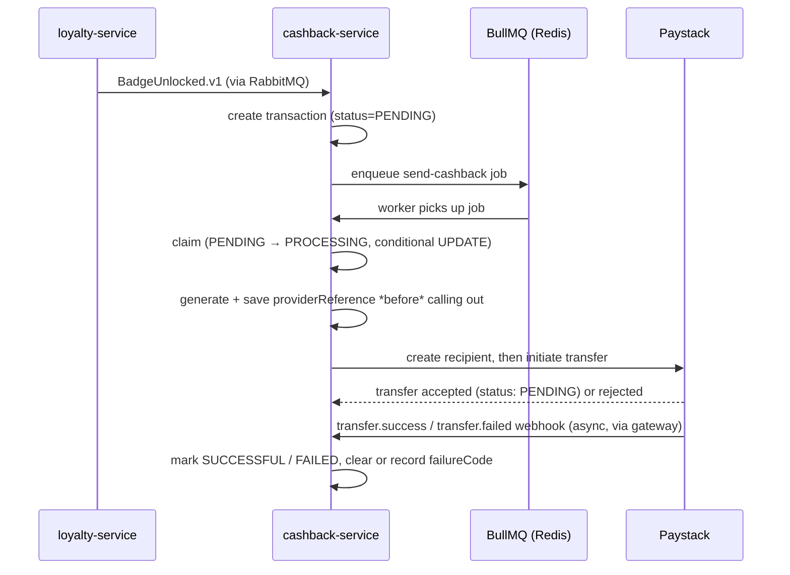
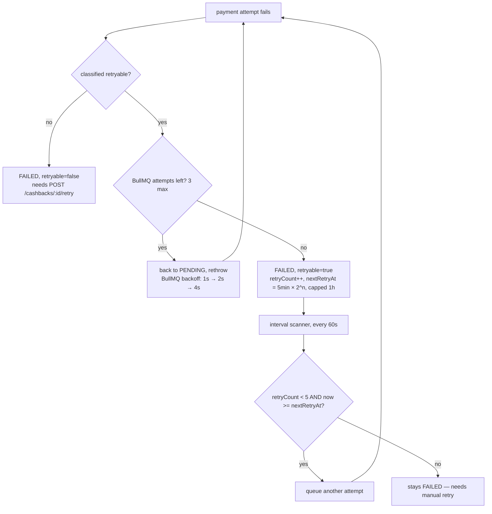

# cashback-service

Owns cashback transactions, payout accounts, and the actual payment-provider integration. This
is the service where "the badge unlocked, now pay the person real money" happens — and
correspondingly, most of the failure-handling complexity in the system lives here, because
payment providers fail in more interesting ways than a database does.

Never has a published port, in any environment — the only way in is through the gateway (see
its README's "Why the webhook lives here" section for how that applies to the Paystack webhook
specifically).

## The payment flow



Why the reference is saved *before* the outbound call, not after: Paystack's webhook can arrive
while our own HTTP call to Paystack is still resolving — under real network timing this isn't
theoretical, it happened in live testing. If the webhook arrives first and looks up the
transaction by a reference we haven't saved yet, it finds nothing, treats it as a stale/unknown
webhook, and returns `200` — which means Paystack considers it delivered and never retries. A
real successful transfer would be lost, permanently, with no error anywhere. Saving the
reference as part of the claim update closes that window.

## Two-tier retry

A payment can fail for reasons worth retrying (Paystack down, insufficient test balance) or
reasons that will never succeed on retry (bad account number, missing bank details). Both tiers
below only ever retry the first kind — see "Failure classification".



- **Fast tier** — BullMQ's own retry (`attempts: 3`, exponential backoff starting at 1s) inside
  the same job. Handles a transient blip in seconds, without ever touching the database as
  `FAILED`.
- **Slow tier** — once BullMQ's attempts are exhausted, the transaction settles `FAILED` with
  `retryable: true` and a `nextRetryAt`. A `setInterval` scanner (`retryEligibleFailedTransactions`,
  every `CASHBACK_RETRY_INTERVAL_MS`) picks up anything past its `nextRetryAt`, up to
  `CASHBACK_MAX_AUTO_RETRIES` attempts total, backing off exponentially (5min → 10min → 20min →
  40min → 1h). Past that cap, it's a dead end until someone calls the retry endpoint.

Both tiers, and the manual retry endpoint, funnel through the *same* BullMQ queue — a manual
retry is never executed inline in the HTTP request. Calling Paystack takes a few real seconds
(create recipient, then initiate transfer); doing that inside the request risks the gateway's own
timeout. `POST /cashbacks/:id/retry` just flips the row back to `PENDING`, enqueues a job, and
returns `202` in milliseconds — the actual attempt happens on the worker.

## Failure classification

Every failure — from the initial call or from an async `transfer.failed` webhook — gets
classified into a `CashbackFailureCode` and a `retryable` flag, in `classifyCashbackFailure()`
(payment-provider.ts) and, for Paystack specifically, a `code`-based map in
`paystack-payment.provider.ts` keyed off Paystack's own machine-readable error `code` field
(more reliable than matching on `message` text, which Paystack doesn't promise to keep stable —
confirmed by probing the real API with several malformed payloads):

| `CashbackFailureCode` | Retryable | Example cause |
|---|---|---|
| `INSUFFICIENT_BALANCE` | yes | Paystack `insufficient_balance` |
| `PROVIDER_UNAVAILABLE` | yes | network error, 429, 5xx |
| `DUPLICATE_REFERENCE` | yes | `duplicate_transfer_reference` |
| `INVALID_ACCOUNT` | no | `invalid_bank_code`, `invalid_account_number`, `invalid_transfer_recipient` |
| `MISSING_BANK_DETAILS` | no | no payout account on file |
| `PROVIDER_MISCONFIGURED` | no | `invalid_Key` — a bad secret key; every future call fails identically until an operator fixes it, so this is never auto-retried |
| `PROVIDER_REJECTED` | no | anything else unrecognized (`invalid_amount`, `missing_params`, or truly unknown) — treated as a dead end deliberately, safer to stop and let a human look than retry something that might never succeed |

The classification, reason, and `retryable` flag are all persisted on the transaction row and
included in the `CashbackProcessed.v1` event when it fails — visible over the API
(`GET /cashbacks`) and to anything tapping the event stream (`npm run watch:events`), not just in
logs.

## Idempotency

- `cashback_transactions` has a unique `(userId, badgeName)` — one transaction per badge per
  user, ever. `handleBadgeUnlocked` upserts against it, so a redelivered `BadgeUnlocked.v1` (see
  `@bumpa/broker-sdk`'s retry behavior) never creates a second payout attempt for the same badge.
- The claim step (`PENDING → PROCESSING`, one conditional `UPDATE`) means two workers racing on
  the same transaction can't both call Paystack — only one wins the update.
- A `processed_events` table dedupes the `BadgeUnlocked.v1` event itself by `eventId`.

## Endpoints

`GET /cashbacks` (paginated, filterable by `userId`/`status`, searchable), `POST
/cashbacks/:id/retry`, and `POST /webhooks/paystack` (signature-verified, see the gateway's
README). Behind the gateway's `x-api-key` guard except the webhook. Full reference:
[`API.md`](../../API.md).

## Configuration

| Env var | Default | Purpose |
|---|---|---|
| `CASHBACK_SERVICE_PORT` | `3004` | port the app listens on |
| `DATABASE_HOST`/`_PORT`/`_USER`/`_PASSWORD`, `CASHBACK_DATABASE_NAME` | — / `cashback_db` | Postgres |
| `RABBITMQ_HOST`/`_PORT`/`_USER`/`_PASSWORD` | — | broker connection |
| `REDIS_HOST`/`_PORT` | — | outbox lock **and** the BullMQ queue |
| `PAYMENT_PROVIDER` | `mock` | `mock` or `paystack` |
| `PAYSTACK_SECRET_KEY` | *(empty)* | required for real transfers; empty ⇒ dry-run (always succeeds, no external call) |
| `CASHBACK_AMOUNT_KOBO` | `30000` | fallback reward if a badge doesn't specify its own |
| `CASHBACK_RETRY_INTERVAL_MS` | `60000` | how often the auto-retry scanner ticks |
| `CASHBACK_RETRY_BASE_DELAY_MS` | `300000` | base delay before the first auto-retry (exponential from here) |
| `CASHBACK_MAX_AUTO_RETRIES` | `5` | cap on automatic retries before it needs a manual one |
| `OUTBOX_BATCH_SIZE` / `_MAX_ATTEMPTS` / `_LOCK_TTL_MS` / `_POLL_INTERVAL_MS` | `20` / `5` / `5000` / `30000` | outbox scanner tuning |

## Packages it depends on

`@bumpa/events-sdk`, `@bumpa/outbox-sdk`, `@bumpa/broker-sdk` (subscribes to `BadgeUnlocked.v1`,
publishes `CashbackProcessed.v1`), `@bumpa/logger-sdk`. Also `bullmq` + `ioredis` directly (not
wrapped in a shared package — only this service needs a job queue).

## Run it alone

```bash
npm run start:dev -w apps/cashback-service
```
