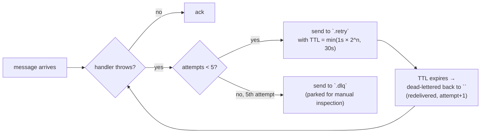

# @bumpa/broker-sdk

A thin RabbitMQ wrapper over `amqplib`, built specifically for this system's needs: publisher
confirms (so the outbox knows a publish actually landed, not just that we called `.publish()`),
automatic reconnect with backoff, and — the part most consumers benefit from without writing any
retry code themselves — a durable, RabbitMQ-native retry queue per subscription.

## Wiring it up

```ts
// app.module.ts
import { BrokerModule } from '@bumpa/broker-sdk';
import { ServiceName } from '@bumpa/events-sdk';

@Module({
  imports: [
    BrokerModule.forRoot({
      serviceName: ServiceName.Cashback,
      connection: { protocol: 'amqp', hostname: 'rabbitmq', port: 5672, username: 'bumpa', password: 'bumpa' },
    }),
  ],
})
export class AppModule {}
```

`BrokerModule` is `@Global()` — import it once at the root, inject `BrokerService` anywhere.

## Publishing

```ts
await this.brokerService.publish(event); // event: DomainEvent from @bumpa/events-sdk
```

In practice nothing calls this directly except `@bumpa/outbox-sdk` — publishing outside a
transaction-then-outbox flow reintroduces the "DB write succeeded, publish didn't" problem this
whole system exists to avoid. See the outbox-sdk README.

Publishes to the shared `bumpa.events` topic exchange, routing key = the event's `type` (so
`BadgeUnlocked.v1` routes to every queue bound to that key). Uses a **confirm channel**: the
publish promise doesn't resolve until RabbitMQ has actually acked the message, which is what
lets the outbox mark a row `PUBLISHED` only when it's genuinely safe to.

## Subscribing

```ts
await this.brokerService.subscribe<BadgeUnlockedEvent>({
  queue: BrokerQueueName.CashbackBadgeUnlocked, // 'cashback.badge-unlocked'
  routingKey: DomainEventName.BadgeUnlocked,
  handler: async (event) => {
    await this.cashbackService.handleBadgeUnlocked(event);
  },
});
```

`subscribe()` declares the queue, binds it to `bumpa.events` on that routing key, and starts
consuming. Call it once per queue per service (typically from a `*.consumer.ts`'s
`onModuleInit`) — subscriptions are also replayed automatically after a reconnect, so a dropped
connection doesn't silently stop consumption.

## What happens when a handler throws

This is the part worth understanding before you write a handler, because it changes how you
think about idempotency:



Three queues exist per subscription, all declared automatically:

| Queue | Purpose |
|---|---|
| `<queue>` | the real queue your handler consumes from |
| `<queue>.retry` | holds a failed message for an escalating TTL (1s → 2s → 4s → 8s → 16s, capped at 30s), then RabbitMQ's own dead-lettering bounces it back to `<queue>` — no in-process timer, no lost retry state on a crash or restart |
| `<queue>.dlq` | where a message lands permanently after 5 failed attempts, for manual inspection (via the RabbitMQ management UI, or `docker:dev`) |

Retry count travels in a message header (`x-bumpa-retry-count`), not in application state, so it
survives a process restart mid-retry.

**Because of this, a handler can be invoked more than once for the same event** — a redelivery
after a transient failure, or a message that failed right before acking. Every consumer in this
system guards against that with a `processed_events` table (see any `*.consumer.ts` +
`ProcessedEvent` entity) — check-then-skip on `eventId` before doing real work. Write new
consumers the same way.

## Local dev

RabbitMQ's management UI (`npm run docker:dev`, `http://localhost:15672`) shows every queue this
creates, live — the Queues tab is the fastest way to see a `.retry`/`.dlq` actually populate
during a bug hunt. `npm run watch:events` (see the root README) taps the exchange directly for a
readable console feed instead.
