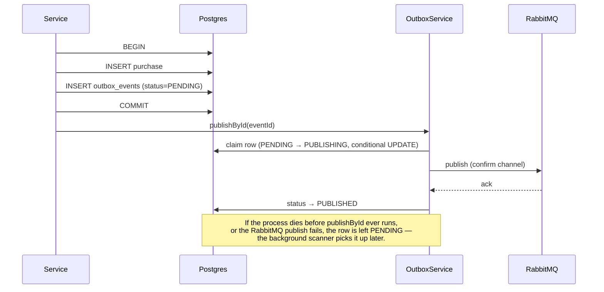

# @bumpa/outbox-sdk

Implements the transactional outbox pattern: a domain-state change and the event announcing it
are written in the **same database transaction**, so they can never disagree. Without this, a
service can commit a DB change, crash (or lose its RabbitMQ connection) before publishing, and
the rest of the system never finds out — a purchase exists that no achievement got checked
against, silently.

## How it works



The domain write and the outbox row land together or not at all — that's the whole guarantee.
Publishing itself happens *after* commit, in two layers:

1. **Immediate publish** — the service calls `publishById(eventId)` right after its transaction
   commits. In the common case this is the only publish attempt that ever happens; the row goes
   `PENDING → PUBLISHING → PUBLISHED` in milliseconds.
2. **Background scanner** (`ScheduledOutboxPublisher`) — runs on `pollIntervalMs` (default 30s),
   picks up any row still `PENDING` (the immediate publish never ran, or failed) and retries it,
   up to `maxAttempts`. This is the safety net for "the process crashed between commit and
   publish" or "RabbitMQ was unreachable for a few seconds."

## `OutboxStatus`

`PENDING` → `PUBLISHING` → `PUBLISHED`, or → `FAILED` after `maxAttempts` is exhausted.
`PUBLISHING` exists specifically to prevent double-publish: claiming a row is one conditional
`UPDATE ... WHERE status = 'PENDING'` — only one caller can ever win it, so the immediate
publish and a concurrent scanner tick can't both send the same event.

## Distributed lock

The scanner acquires a Redis lock (`SET NX` + TTL, with a heartbeat that renews it while a batch
is in flight) before scanning. If you run more than one replica of a service, only one of them
runs the scanner at a time — without this, N replicas would all try to claim and publish the
same pending rows every poll interval.

## Wiring it up

Your service needs an entity matching `OutboxRecord` (`id`, `payload`, `status`, `attempts`,
`lastError?`, `createdAt`, `publishedAt?`):

```ts
@Entity('outbox_events')
export class OutboxEvent {
  @PrimaryColumn() id!: string;
  @Column() eventType!: string;
  @Column() routingKey!: string;
  @Column({ type: 'jsonb' }) payload!: BumpaDomainEvent;
  @Column({ default: OutboxStatus.Pending }) status!: OutboxStatus;
  @Column({ default: 0 }) attempts!: number;
  @Column({ nullable: true, type: 'text' }) lastError?: string;
  @CreateDateColumn() createdAt!: Date;
  @Column({ nullable: true }) publishedAt?: Date;
}
```

```ts
// app.module.ts
OutboxModule.forRoot({
  entity: OutboxEvent,
  lockKey: OutboxLockKey.Cashback, // one per service, so locks don't collide
  redis: { host: 'redis', port: 6379 },
  batchSize: 20,       // rows per scanner tick, default 20
  maxAttempts: 5,       // default 5
  lockTtlMs: 5000,      // default 5000
  pollIntervalMs: 30000, // default 30000
}),
```

## Using it

```ts
// Inside the same transaction as your domain write:
await manager.save(OutboxEvent, manager.create(OutboxEvent, {
  id: event.eventId,
  eventType: event.type,
  routingKey: event.type,
  payload: event,
}));

// After the transaction commits:
await this.outboxService.publishById(event.eventId);
// or, for several events from one transaction:
await this.outboxService.publishMany([eventId1, eventId2]);
```

`publishById`/`publishMany` are best-effort and non-throwing on failure — if RabbitMQ is
unreachable right now, the row just stays `PENDING` for the scanner to pick up on its next tick.
That's the point: the immediate call is a latency optimization, not the actual correctness
guarantee. The guarantee is "eventually published, because the row exists and the scanner will
find it."
